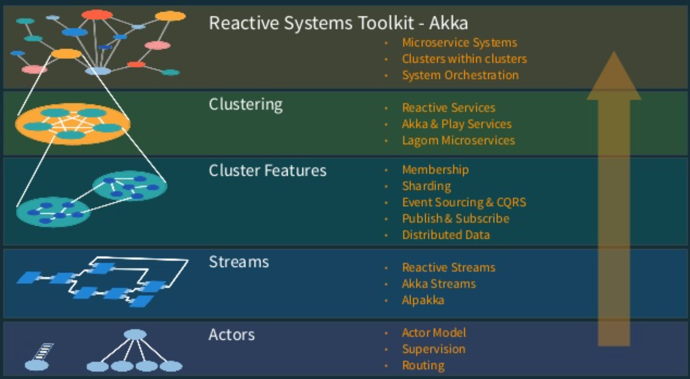
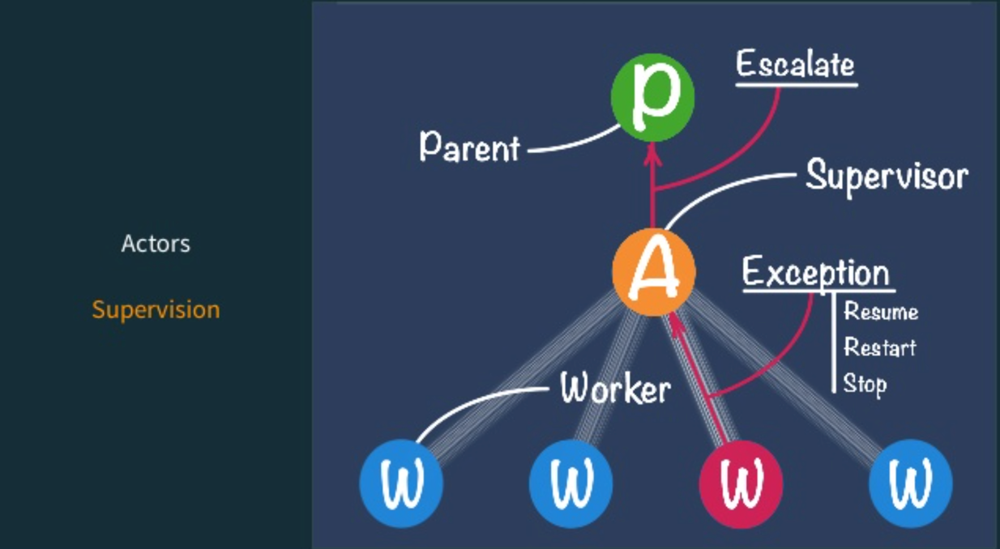
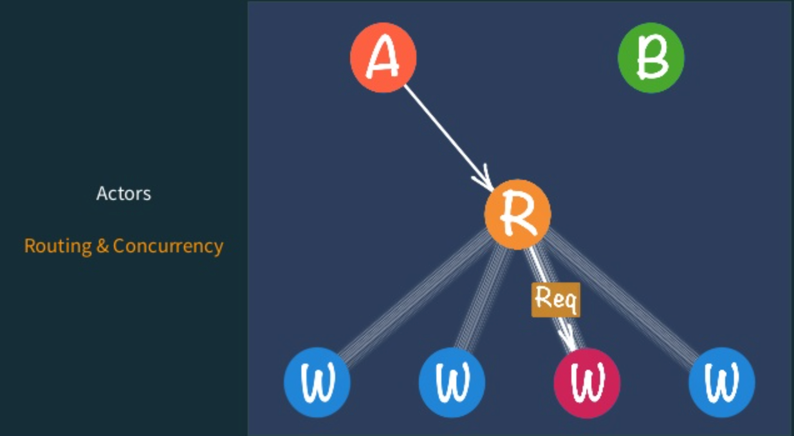
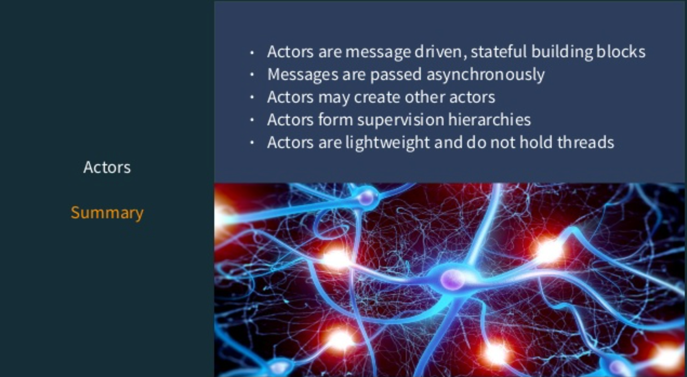

# Introduction to Akka
The Akka name comes from the goddess in the Sami (native swedes) mythology that represented all the wisdom and beauty in
the world.

Akka - Initially developed by Jonas Boner in 2009

It was inspired by Carl Hewitt's early 70's work and the Erlang runtime system.

Akka is a set of open-source libraries for designing distributed, scalable, resilient, highly concurrent event driven
systems with Actor Model on JVM - Java & Scala.

Akka allows you to focus on meeting business needs instead of writing low-level code to provide reliable behavior, fault
tolerance, and high performance.

### Akka provides:

1. Multi-threaded behavior without the use of low-level concurrency constructs like atomics or locks — relieving you
   from even thinking about memory visibility issues.
2. Transparent remote communication between systems and their components — relieving you from writing and maintaining
   difficult networking code.
3. A clustered, high-availability architecture that is elastic, scales in or out, on demand — enabling you to deliver a
   truly reactive system.

Akka’s use of the actor model provides a level of abstraction that makes it easier to write correct concurrent, parallel
and distributed systems. The actor model spans the full set of Akka libraries, providing you with a consistent way of
understanding and using them.

### What is an Akka Actor?

1. Akka's unit of code organization is called an Actor
2. Actors helps to create concurrent, scalable and fault-tolerant applications.
3. Like Java EE Servlets and Session Beans, Actor is a model for organizing code.

#### High level overview of Akka System:

## Akka Cluster

1. Cluster Membership
2. Leader & Singleton
3. Cluster Sharding
4. Clustered Routers
5. Clustered Supervision and Deathwatch
6. Clustered Pub/Sub

#### Cluster membership in Akka

1. Dynamo-Style leader-less (decentralized p2p)
2. Epidemic GOSSIP - Node Ring
3. Vector Clocks for casual consistency
4. Fully Elastic with No SPOF or SPOB
5. Very Scalable
6. High Throughput

### A Cluster Node Lifecycle in Akka:

### Akka Modules for distributed computing

1. Akka Cluster
2. Akka Remote
3. Akka Http
4. Akka IO

### Actors - Routing & Concurrency:

### Actor Summary:

# Base Experiment

The experiments are conducted on a Mac Machine with 8 CPUs and 16 GB Memory.
The JVM Memory was set with max heap memory of 4 GB.
There was one Akka message producer actor

There was one Akka consumer actor, there were as many as 5 workers behind this one single consumer. 

## Experiment Hardware Configuration
Each test should be ran using Ubuntu 20.04 chameleon cloud VM’s with 8 CPU and 32 GB of RAM. If these hardware specs aren’t attainable, use the nearest available and document the configuration. Please also use internal IP addresses for all communication to simulate a more consistent network topology with less traffic. 

## Compatibility 
Here we wish to understand where the tech is easily used

### Qualitative 

For MQ experiments, see [Base MQ experiment](./Base-MQ.md)

For data stores, TBD.

### Basic Information
- How many individual actors can connect to this system at one time?
  - It's in terms of millions of actors per JVM node.
  - It is limited by the JVM Memory.
- What license does it operate under?
  - Apache 2 license
- How much must be paid to use this technology?
  - Open Source, no fees as such.
- Does it have explicit enterprise support?
  - Yes, enterprise support from https://www.lightbend.com
  
### Operating Systems
Can it be installed on the below?

|Operating System|Yes/No|Link to steps|Average Install Time| Number of Manual Steps to Install|
|--|--|--|--|--|
Ububtu 18.04|Yes|||
Ububtu 20.04|Yes|||
Windows 7|Yes|||
Windows 10|Yes|||
Mac|Yes|||
Docker (Windows)|Yes|||
Docker (Ububtu 20.04)|YEs|||
Docker (Mac)|Yes|||
Raspian|Yes|||
Android|Yes|||
iOS||||

### Hardware Architectures 
Can it run on these CPUs?

|CPU Family|Yes/No|Known Limitations|
|---|---|---|
ARM|Yes|
INTEL|Yes|
AMD|Yes|
Embedded (Eiger, Aruix, etc.)||

### Hardware Needs 
Create this table for all OS and CPU combinations tested 

#### EX: OS_A on CPU_B
<--MAP THIS TO THE EXPERIMENTS COMPLETED FOR YOUR TECHNOLOGY-->

||CPU|RAM|Hard Disk Memory|
| --- | --- | --- | --- |
|Idle||||
|Max Observed Under Load A||||
|Average Observed Under Load A||||
|Max Observed Under Load B||||
|Average Observed Under Load B||||

### Language Support 
Are there commercially available libraries for the following languages?

| Programming Language|Yes/No|Link|
| --- | --- | --- |
| Python|||
| JavaScript|||
| C|||
| C++|||
|C#|||
|Objective-C|||
|Java|Yes||
|Kotlin|||
|Swift|||
|Go|||
|Ruby|Yes (JRuby)||
|Powershell|||
|Perl|||
|Rust|||
|Elixr|||

# Base Experiment (MQ)

This experiment is an extension of the [Base experiment](./Base.md) that is specific to MQ technologies.

## Qualitative Data

These metrics are inspired by Zhuangwei Kang's presentation he shared with us. Fill in with information you discover about your chosen MQ.

| Metric | Value |
| --- | --- |
| Centricity (data-centric or message-centric) | message-centric |
| Connection (machine-to-machine or point-to-point) | point-to-point|
| Underlying Architecture (decentralized or hub-and-spoke) | decentralized|
| Protocol | tcp/udp|
| Transport(s) | |
| Data Serialization | yes |
| Supports Queuing | yes |
| Data Type Representation | Any serializable message |
| QoS Parameters | |
| Supports Dynamic Discovery | yes |
| Communication Patterns | peer to peer, pub/sub, clustered|
| Abstraction Layer | Yes |
| Up-front Complexity | Yes |
| Large Implementations | Yes |

